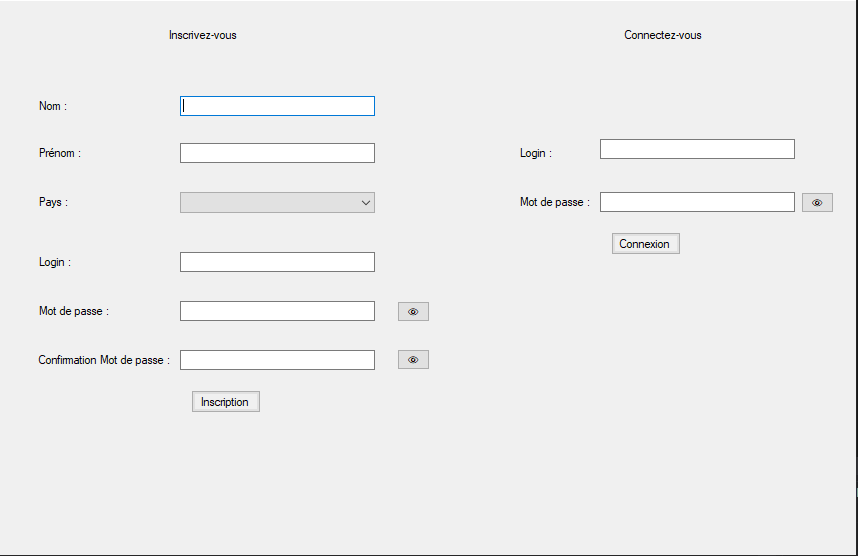

<!--> Ceci doit être le fichier README.md à la racine de votre dépôt <-->

# Informations générales

## Equipe

- Numéro d'équipe : 3.3
- Nom de la base de données : MusiquePT2_M
- Composition de l'équipe :
  - CUGNO Evans
  - DUTHIL Thomas
  - HALLEY Tristan
  - JEDDI Achraf
  - MOUSSIRON Nathan

## Projet

Le logiciel DiscoWARE, permet à un utilisateur de gérer ses albums empruntés. L'administrateur de son côté, peut s'occuper des différentes tâches pour la maintenance de son stock.

Pour accéder à l'interface administrateur, il faut renseigner dans les champs login et mdp, "admin."
Si jamais on a recherché à l'aide de la barre de recherche, elle nous affiche donc les résultats de notre requête, pour revenir à nos emprunts, il faut vider cette barre, il n'y a pas de bouton.

Lorsque vous serez dans l'interface administrateur si jamais vous appuyez sur un des boutons, penser à remplir le champ NumericUpDown afin d'afficher par exemple les retards en fonction de cette date. Pour revenir sur l'interface originelle d'administrateur, il faut appuyer sur le bouton purgeur et faire non, ou simplement fermer la fenêtre et se re-login.

Une capture de l'écran d'accueil :

# User Stories

## US1: En tant que futur client de la discothèque, je souhaite pouvoir être abonné afin de pouvoir emprunter des albums.

- [x] US implémentée (on peut emprunter et rendre un album)

Cas limite et détails:
- [x] Qu’est-ce qui se passe si on essaie de s’inscrire avec un login déjà existant ?
- [x] Est-ce que le choix du pays est bien un menu déroulant ?
- [x] Est-ce que les champs sont bien limités à 32 caractères ?
- [X] Peut-on s'inscrire avec un nom vide ?
- [X] Peut-on s'inscrire avec un nom qui ne contient qu'un espace ?
- [X] Est-ce qu'il est bien possible de s'inscrire sans pays (car c'est facultatif) ?
- [X] L'ordre des champs est correct lorsqu'on appuie sur "TAB"
- [ ] Est-ce que des messages d'erreur explicitent apparaissent en cas d'erreur ? ("Le champ prénom n'a pas été rempli", "Ce login est déjà utilisé" etc.)

## US2: En tant qu’abonné, je souhaite pouvoir consulter les albums que j'ai empruntés.
- [X] US implémentée

Cas limite et détails:
- [X] Qu’est-ce qui se passe si j’essaie d’emprunter un album déjà emprunté ? (Penser à essayer tous les cas, comme cliquer 2 fois sur le bouton “emprunter”)
- [X] Qu’est-ce qui se passe si j’emprunte, je retourne, et que je ré-emprunte le même album ?
- [X] Est-ce que la date de retour est bien basée sur les délais de la table "Genre" ?
- [X] Est-ce que je distingue bien les albums disponibles des empruntés dans l'affichage ?
- [ ] Est-ce que je vois bien toutes les informations sur les albums (casier, rangée, éditeur, pays de l'éditeur, année d'édition...)

## US3: En tant qu’abonné, je souhaite prolonger l'emprunt d'un album pour un mois supplémentaire (cette opération n’est possible qu’une fois par emprunt).
- [X] US implémentée

Cas limite et détails:
- [X] Qu’est-ce qui se passe si on essaie de re-prolonger ? (Penser à essayer un peu tous les cas, comme cliquer 2 fois sur le bouton “prolonger”)
- [X] Est-ce que je ne peux prolonger que les non rendus ?

## US11: En tant que client du projet, je souhaite une proposition de maquette d’IHM qui après validation pourra donner lieu à un développement.

- [X] L'interface est fonctionnelle
- [X] L'interface est ergonomique (UX)
- [ ] L'interface est esthétique (UI)

## US4: En tant qu’administrateur je souhaite connaître les emprunts qui ont été prolongés.
- [X] US implémentée

Cas limite et détails:
- [X] Vois-je suffisamment d’infos par emprunt (nom de l'emprunteur, dates, album...) ?
- [X] Est-ce qu'ils sont triés par date ?

## US5: En tant qu’administrateur de la discothèque en ligne, je souhaite lister les abonnés ayant des emprunts non rapportés en retard de 10 jours.
- [X] US implémentée

Cas limite et détails:
- [X] Vois-je suffisamment d’infos par emprunt (nom de l'emprunteur, dates, album...) ?
- [X] Est-ce qu'ils sont triés par date ?

## US6: En tant qu'administrateur de la discothèque en ligne, j'aimerais pouvoir purger les abonnés n'ayant pas emprunté depuis plus d'un an.
- [X] US implémentée

Cas limite et détails:
- [ ] Vérifier qu’on a bien une confirmation qui nous indique quels utilisateurs vont être purgés
- [ ] Vérifier que les utilisateurs qui ont des emprunts en cours ne sont de toutes façons pas purgés

## US7: En tant qu’administrateur de la discothèque, je souhaite connaître les 10 albums les plus empruntés dans l'année.
- [X] US implémentée

Cas limite et détails:
- [X] Bien vérifier que c’est ceux de l’année et pas de toute la base de données

## US8: En tant qu’administrateur de la discothèque en ligne, je souhaite connaître les albums qui n’ont pas été empruntés depuis plus d’un an.
- [ ] US implémentée

Cas limite et détails:
- [X] Vérifier que les albums qui n’ont jamais été empruntés apparaissent bien
- [X] On a demandé également de trier par date décroissante d’emprunt (les empruntés le plus récemment doivent apparaître en premier)

## US9: En tant qu’abonné, je souhaite prolonger l'emprunt de tous mes emprunts.
- [X] US implémentée

Cas limite et détails:
- [X] Vérifier que les emprunts rendus ne sont pas prolongés
- [X] Vérifier que les déjà prolongés ne sont pas prolongés

## US10: En tant qu’abonné, je souhaite que le logiciel me suggère des albums à emprunter qui peuvent me plaire.
- [X] US implémentée

Cas limite et détails:
- [ ] Est-ce que la suggestion exploite la popularité (exemple: genre similaire aux albums que j'ai empruntés, et trié par nombre de fois que les albums ont été empruntés)
- [ ] Affiche les bonnes infos ? (où sont-ils… empruntés ou rangée/casier)

## US-TU1: Tests unitaires

À ce stade, la priorité est d'avoir des tests unitaires fonctionnels pour US1 & US2

- [ ] Les tests ou une procédure documentée permet de remettre la base de données dans un état connu (on ne se base pas sur l'état de la base de données au moment de lancer les tests)
- [X] US1
- [X] US2

# US12: En tant qu'administrateur, je veux pouvoir lister tous les abonnés
- [X] US implémentée

Cas limite et détails:
- [X] Est-ce qu'on affiche bien toutes les informations ?
- [X] Quel critère de tri ?

# US13: En tant qu’utilisateur du logiciel, je souhaite que les résultats soient paginés dès que la liste est trop longue pour un meilleur confort d’utilisation.
- [ ] US Implémentée

Cas limite et détails:
- [ ] Est-ce que la pagination est bien performante ? C'est-à-dire est-ce que les données sont bien récupérées uniquement au besoin et pas toutes dans le C#

# US14: En tant qu'utilisateur, je souhaite pouvoir rechercher un album par son nom
- [X] US Implémentée

Cas limite et détails:
- [ ]  Qu’est-ce qui se passe si on tape "mozart requiem"
  - On s’attend à voir “Mozart Verdi: Requiem” (deux mots clés mais séparés dans le titre trouvé)
- [ ]  Qu’est-ce qui se passe si on tape "bach flute" ou "bach flûte"
  - On s’attend à voir "Bach: Sonates pour flûte” (accent sur le û)
- [ ]  Qu’est-ce qui se passe si on tape "violoncelles bach"
  - On s’attend à voir “Bach: Suites pour violoncelles” (les mots ne sont pas dans l’ordre)

# US15: En tant qu'abonné et administrateur, on souhaite voir les pochettes d'album dans l'IHM lorsqu'ils sont mentionnés
- [ ] US Implémentée

# US16: Nous souhaitons améliorer la gestion des mots de passe

- [X] Au moment de l'inscription, je fournis le mot de passe deux fois (pour m'assurer que je ne me suis pas trompé)
- [ ] S'assurer qu'ils ne soient pas stockés en clair dans la base de données
- [ ] Un administrateur peut changer le mot de passe de n'importe quel utilisateur
- [ ] Un utilisateur peut changer son mot de passe, il fournit son mot de passe actuel et le nouveau mot de passe (2 fois)
- [X] Tous les champs qui contiennent des mots de passe ne sont pas visible à l'écran (mais des *** à la place), mais avec possibilité des les révéler (bouton "œil")
- [X] Quand les mots de passes ne correspondent pas, un message d'erreur clair apparaît

# US17: En tant qu'administrateur, je souhaite voir les albums manquants (empruntés) d'un casier (note pour nous : ce peut-être simplement rajouter un filtre au bon endroit)

- [ ] US Implémentée

# US18: En tant que mainteneur, je souhaite m'assurer que le code correspond aux normes d'architecture logicielle, de qualité et de documentation en vigueur

- [ ] Le code est bien factorisé (réduire les duplications)
- [ ] Commentaires des fonctions
- [ ] Règles de codage homogène (libre)

## US-TU2: Tests unitaires extra

- [ ] US3
- [ ] US4
- [ ] US5
- [ ] US6
- [ ] US7
- [ ] US8
- [ ] US9
- [ ] US10
- [ ] US12
- [ ] US13
- [ ] US14
- [ ] US16
- [ ] US17
